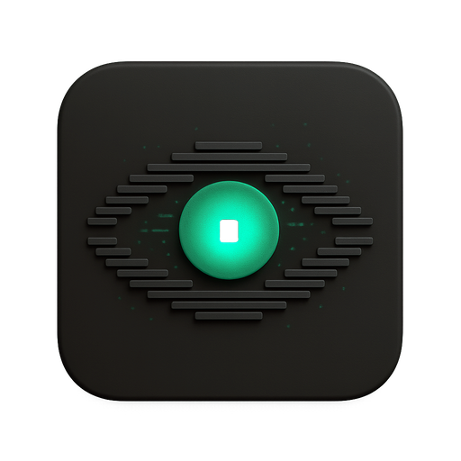

<p align="center"> 
  
</p>

# Codex Trace

[](https://github.com/PixelPaw-Labs/codex-trace/actions/workflows/ci.yml)
[](LICENSE)
[](https://www.rust-lang.org/)
[](https://react.dev/)
[](https://v2.tauri.app/)
[](https://github.com/PixelPaw-Labs/codex-trace/releases)

**Codex Trace** is an **OpenAI Codex CLI session log viewer** for local JSONL files stored in `~/.codex/sessions/`.

Browse, search, live-tail, and inspect [Codex CLI](https://github.com/openai/codex) conversations in a native desktop app and web UI. Codex Trace renders Codex CLI JSONL session files as readable turns with tool calls, token counts, timestamps, collaboration chains, and live SSE tailing for ongoing sessions.

Use Codex Trace when you want to:

- View OpenAI Codex CLI conversation history from `~/.codex/sessions/`
- Browse Codex CLI JSONL session logs without reading raw JSONL files
- Search Codex CLI sessions and messages
- Inspect Codex CLI tool calls, command output, MCP tools, patches, web searches, and image generation events
- Review token usage from previous Codex CLI sessions
- Monitor active Codex CLI sessions in real time
- Debug long-running Codex CLI workflows from a desktop or browser interface
- Support and build a personal AI harness platform such as [DovePaw Lite](https://github.com/PixelPaw-Labs/DovePaw-Lite)

> Codex Trace is also used to support and build [**DovePaw Lite**](https://github.com/PixelPaw-Labs/DovePaw-Lite), a personal AI harness platform for orchestrating local agents.
>
> Claude Code user? See [claude-code-trace](https://github.com/delexw/claude-code-trace) instead.


## Features

- **Codex CLI JSONL viewer** — reads local Codex CLI session files from `~/.codex/sessions/`
- **3-panel layout** — date-grouped session tree → turn list → turn detail
- **Session and message search** — find Codex CLI sessions and messages faster than reading raw logs
- **Live tailing** — SSE-based updates for ongoing Codex CLI sessions
- **Tool call inspection** — inspect exec commands, MCP tools, patch apply events, web searches, image generation events, and collaboration agent activity
- **Collaboration tracking** — links orchestrator and worker sessions
- **Token visibility** — shows token counts where available in Codex CLI session data
- **Multiple Codex JSONL formats** — supports new (≥0.44), mid, and oldest (2025/08) session metadata formats
- **Desktop and web modes** — run as a native desktop app or browser-based viewer
- **Docker support** — run headless web mode on port 1422

## Why use Codex Trace?

Codex CLI stores local session history as JSONL files. Those files are useful for debugging and reviewing AI coding sessions, but they are difficult to read directly. Codex Trace turns Codex CLI logs into an interactive session viewer so you can search conversations, inspect tool usage, review token counts, follow collaboration chains, and debug Codex workflows faster.

Unlike general observability platforms, Codex Trace focuses on local Codex CLI session logs from `~/.codex/sessions/`. It does not require sending traces to an external service.

Codex Trace is especially useful when building personal AI harnesses and local agent platforms. It helps inspect Codex CLI sessions, understand tool usage, follow collaboration chains, and debug the workflows that power projects like [DovePaw Lite](https://github.com/PixelPaw-Labs/DovePaw-Lite).

## Install

### Build from source

Use this option if you want to build Codex Trace locally on macOS, Linux, or Windows with Rust and Node.js installed.

```bash
git clone https://github.com/PixelPaw-Labs/codex-trace.git
cd codex-trace
./script/install.sh       # macOS → Codex Trace.app in /Applications; Linux → cargo binary

# Launch the desktop app:
#   macOS:  open -a "Codex Trace"   (or from Launchpad/Applications)
#   Linux:  codex-trace
codex-trace --web         # web mode (opens browser)
```

### Run from source without installing

```bash
git clone https://github.com/PixelPaw-Labs/codex-trace.git
cd codex-trace
npm install

npm run tauri dev        # desktop app with hot reload
npm run dev:web          # web mode (opens browser)
```

### Run in Docker

Docker is supported for web mode only.

```bash
docker build -t codex-trace .
docker run --rm -p 1422:1422 \
  -v "$HOME/.codex/sessions:/home/app/.codex/sessions:ro" \
  codex-trace
# then open http://localhost:1422
```

Or with Docker Compose:

```bash
docker compose up --build
```

To expose multiple mounted Codex homes, set a discovery root and mount each home at
`<root>/<name>/home/.codex`:

```bash
docker run --rm -p 1422:1422 \
  -e CODEXTRACE_CODEX_HOMES_ROOT=/app \
  -v "/app/discord-test/home/.codex:/app/discord-test/home/.codex:ro" \
  -v "/app/slack-test/home/.codex:/app/slack-test/home/.codex:ro" \
  -v "/app/slide-test/home/.codex:/app/slide-test/home/.codex:ro" \
  codex-trace
```

Opening the page now shows `discord-test`, `slack-test`, and `slide-test`. The
selection belongs to that browser page, and **Switch Home** returns to the list.
Only direct children with a readable `home/.codex/sessions` directory are shown.

The included Compose override provides the same three-source layout. Override
`DISCORD_CODEX_HOME`, `SLACK_CODEX_HOME`, and `SLIDE_CODEX_HOME` when the host paths
differ:

```bash
docker compose -f docker-compose.yml -f docker-compose.multi-home.yml up --build
```

## Session format

Codex Trace reads session files from this default path:

```text
~/.codex/sessions/YYYY/MM/DD/rollout-{ISO_TIMESTAMP}-{UUID}.jsonl
```

The sidebar reflects the folder structure exactly. Date groups in `YYYY/MM/DD` format can be collapsed and expanded, with Codex CLI sessions shown underneath.

## Configuration

Press `,` to open Settings and change the sessions directory.

Default sessions directory:

```text
~/.codex/sessions
```

Environment variables for headless and Docker mode:

| Variable                      | Default     | Description                                                 |
| ----------------------------- | ----------- | ----------------------------------------------------------- |
| `CODEXTRACE_HTTP_HOST`        | `127.0.0.1` | Bind host                                                   |
| `CODEXTRACE_HTTP_PORT`        | `11424`     | Bind port                                                   |
| `CODEXTRACE_STATIC_DIR`       | —           | Path to built frontend `dist/`                              |
| `CODEXTRACE_CODEX_HOMES_ROOT` | —           | Enables multi-home discovery at `<root>/<name>/home/.codex` |

When `CODEXTRACE_CODEX_HOMES_ROOT` is unset, the existing Settings value or
`~/.codex/sessions` remains the single automatically selected source. When it is
set, the discovered mount list is authoritative and the single-directory setting
is not used.

## Development

```bash
npm install
npm run dev          # Vite dev server, frontend only
npm run tauri dev    # full Tauri app
```

### Check and test

```bash
npm run check        # tsc + oxlint + oxfmt + cargo clippy/fmt/test
```

Run checks before submitting a pull request.

## Contributing

Bug reports, feature requests, and pull requests are welcome. Run `npm run check` before submitting — it covers TypeScript, linting, formatting, Clippy, Rust formatting, and Rust tests.

## License

[MIT](LICENSE)
